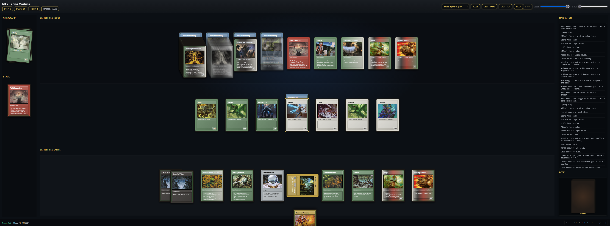

# Urza’s Universal Machine

A visual simulator for the Turing-complete construction from the paper ["Magic: The Gathering is Turing Complete"](https://arxiv.org/abs/1904.09828).

For sake of simplicity, the simulator uses a tape of infinite size and considers key cards like blazing archon to have infinite power and toughness, making this setup not quite tournament legal.

## Screenshot



## Overview

This project implements a Universal Turing Machine using Magic: The Gathering game rules. The simulator features:

- **Core engine** (`MTGSimulator.py`): Executes Turing machine steps using MTG phases and triggers
- **Transition table** (`UniversalTuringMachineTransitions.py`): Defines the state/symbol mappings
- **Web UI** (`web_server.py`): Interactive visualization with step-by-step execution
- **Test suite** (`test_MTG.py`): Comprehensive unit and integration tests

## Installation
```
bash
# Create virtual environment
python -m venv .venv

# Activate virtual environment
source .venv/bin/activate  # On Windows: .venv\Scripts\activate

# Install dependencies
pip install -r requirements.txt
```
## Usage

### Interactive Web UI
```
bash
python web_server.py
```
Then open http://127.0.0.1:60720 in your browser.

**Controls:**
- **Step Frame** — Execute one visual frame (single phase)
- **Step Step** — Execute one full computational step (complete turn cycle)
- **Play / Stop** — Autoplay through the simulation
- **Speed** — Control autoplay speed
- **Radius** — Control how many tape cells are visible around the head
- **Scenario Selector** — Load different pre-configured machines

### Command-Line Interface
```
bash
python MTGSimulator.py scenarios/short_run.json
```
### Running Tests
```
bash
python -m unittest test_MTG.py
```
## Project Structure
```

MTGTuring/
├── MTGSimulator.py                       # Core Turing machine engine
├── UniversalTuringMachineTransitions.py  # State transition table
├── web_server.py                         # FastAPI web server
├── test_MTG.py                           # Test suite
├── scenarios/                            # Example machine configurations
│   └── *.json
└── web/                                  # Frontend files
    ├── index.html
    ├── app.js
    ├── style.css
    └── images/                           # Card artwork
```
## How It Works

The simulator models a Turing machine where:

1. **Tape cells** are represented by creature tokens on the battlefield
2. **Reading** is performed by Infest (kills creatures with -2/-2)
3. **Writing** is triggered by Rotlung Reanimator / Xathrid Necromancer (create new tokens)
4. **Head movement** is determined by token color:
   - White → Move left (−1)
   - Green → Move right (+1)
   - Blue → Halt
5. **State changes** are encoded in tapped status and triggered by Soul Snuffers
6. **Halting** occurs when Coalition Victory fires (Assassin token + blue color)

### Turn Structure

Each computational step consists of multiple game turns:

1. **Alice's Turn:**
   - Untap Step (triggers Mesmeric Orb)
   - Upkeep Step (Wild Evocation casts a spell from hand)
   - Draw Step
2. **Bob's Turn:** pass
3. Repeat until Soul Snuffers is cast (state change complete)

### Spell Rotation

The machine cycles through these spells each step:

| Spell | Purpose |
|---|---|
| Infest | Read the tape (kills head creature) |
| Cleansing Beam | Move the head (+2/+2 to direction color via Vigor) |
| Coalition Victory | Check halt condition |
| Soul Snuffers | Update state, move head |

## Scenario Format

Scenarios are JSON files in `scenarios/` defining the initial tape configuration:
```
json
{
  "name": "Example Scenario",
  "description": "A simple test",
  "state": "q1",
  "head": 0,
  "tape": {
    "0": "Rhino",
    "1": "Elf",
    "-1": "Basilisk"
  },
  "expected": {
    "after_steps": 5,
    "state": "q2",
    "head": 3,
    "halted": false,
    "tape": {
      "0": "Assassin",
      "1": "Demon"
    }
  }
}
```
The optional `expected` block is used by the test suite to validate correctness.

### Available Creature Types (Tape Symbols)

- **Cephalid** — Blank symbol
- Aetherborn, Assassin, Basilisk, Demon, Elf
- Faerie, Giant, Harpy, Illusion, Juggernaut
- Kavu, Leviathan, Myr, Noggle, Orc
- Pegasus, Rhino, Sliver

## Development

### Adding New Scenarios

1. Create a new `.json` file in `scenarios/`
2. Define the initial `state`, `head`, and `tape`
3. Optionally add an `expected` block for automated testing
4. The scenario will automatically appear in the web UI selector

### Running in Development Mode

The web server supports hot-reload:
```
bash
python web_server.py
# Server restarts automatically on code changes
```
## Technical Details

- **Python:** 3.10.6
- **Frontend:** Vanilla JavaScript (no frameworks)
- **Backend:** FastAPI with WebSocket support
- **Testing:** Python `unittest`

## Credits

Based on the academic paper:
> Churchill, A., Biderman, S., & Herrick, A. (2019). *Magic: The Gathering is Turing Complete*. arXiv:1904.09828

## License

This project is licensed under the Creative Commons Attribution-NonCommercial-ShareAlike 4.0 International License (CC BY-NC-SA 4.0) — see `LICENSE` for details.

Card images and data are sourced from [Scryfall](https://scryfall.com/) and are subject to Wizards of the Coast's Fan Content Policy.

## Contributing

Contributions are welcome! Please feel free to open issues or pull requests.

---

> **Note:** This is a theoretical simulation. The construction requires specific MTG card combinations and rule interpretations that may not be tournament-legal.
